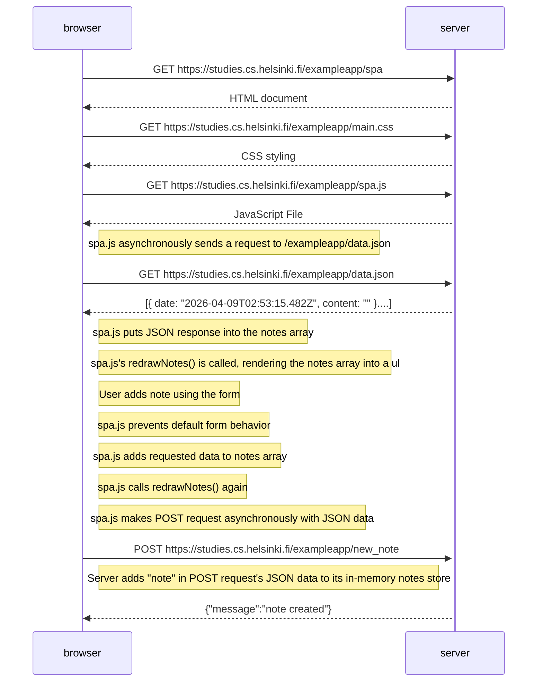

```mermaid
sequenceDiagram
    participant browser
    participant server

    browser->>server: GET https://studies.cs.helsinki.fi/exampleapp/spa
    activate server
    server-->>browser: HTML document

    browser->>server: GET https://studies.cs.helsinki.fi/exampleapp/main.css
    activate server
    server-->>browser: CSS styling

    browser->>server: GET https://studies.cs.helsinki.fi/exampleapp/spa.js
    activate server
    server-->>browser: JavaScript File

    Note right of browser: spa.js asynchronously sends a request to /exampleapp/data.json

    browser->>server: GET https://studies.cs.helsinki.fi/exampleapp/data.json
    activate server
    server-->>browser: [{ date: "2026-04-09T02:53:15.482Z", content: "" }....]

    Note right of browser: spa.js puts JSON response into the notes array
    Note right of browser: spa.js's redrawNotes() is called, rendering the notes array into a ul

    Note right of browser: User adds note using the form
    Note right of browser: spa.js prevents default form behavior
    Note right of browser: spa.js adds requested data to notes array
    Note right of browser: spa.js calls redrawNotes() again
    Note right of browser: spa.js makes POST request asynchronously with JSON data

    browser->>server: POST https://studies.cs.helsinki.fi/exampleapp/new_note
    activate server
    Note left of server: Server adds "note" in POST request's JSON data to its in-memory notes store
    server-->>browser: {"message":"note created"}
```